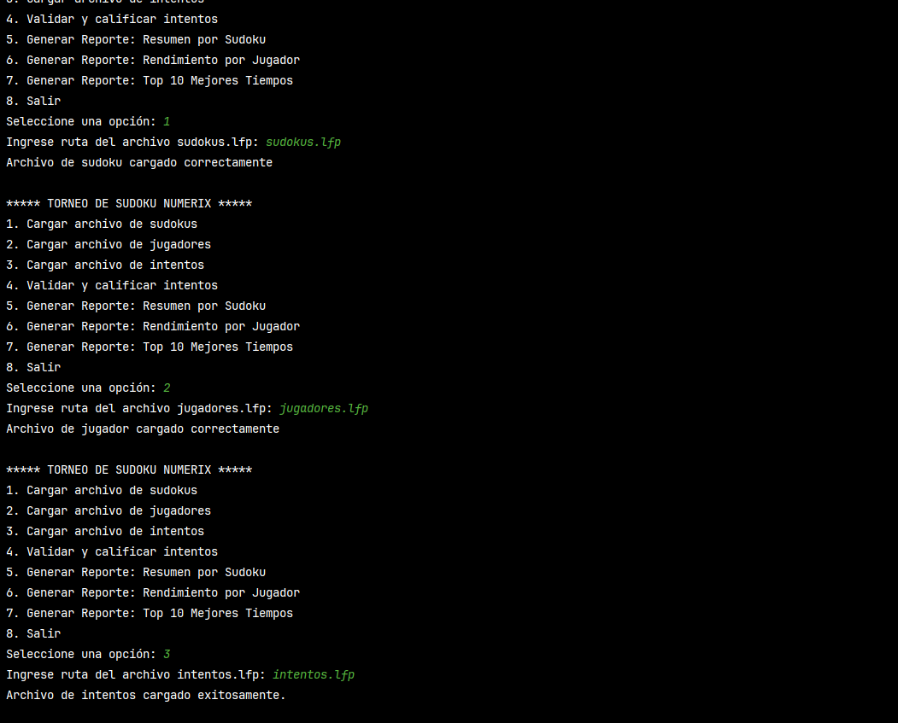
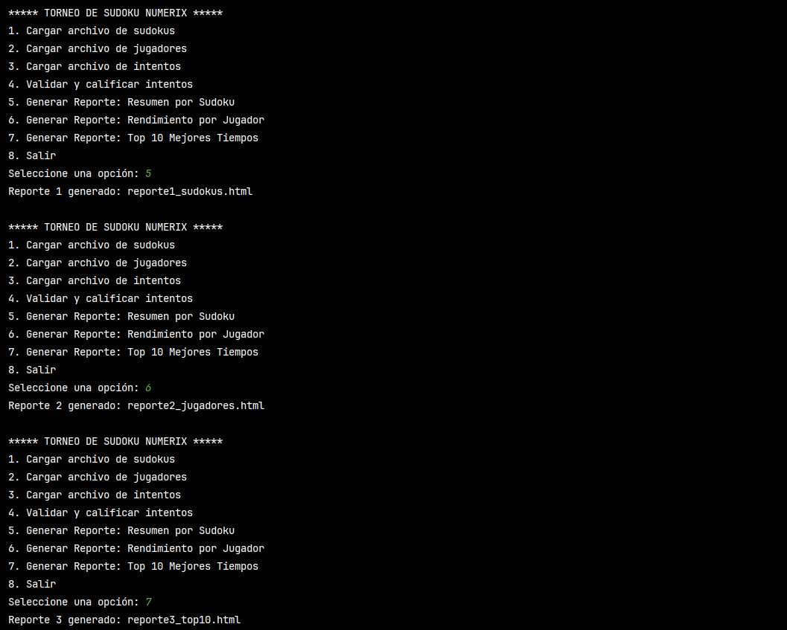
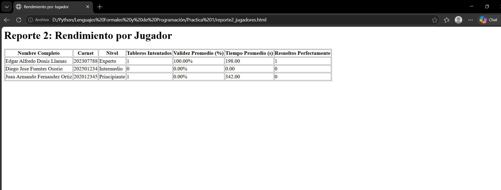

# Manual de Usuario
**USAC - Ingeniería en Ciencias y Sistemas**  
**Proyecto:** Torneo de Sudoku: Validación y Análisis de Partidas  
**Autor:** Edgar Alfredo Donis Llamas  
**Carnet:** 202307788  
**Laboratorio Lenguajes Formales y de Programación B+**

---

## 1. Introducción
Bienvenido al Sistema de Calificación y Análisis del Torneo de Sudoku "Numerix Academy". Este programa de consola ha sido diseñado para facilitar a los organizadores la carga de participantes, la recepción de intentos de resolución y la calificación automática basada en las reglas clásicas del Sudoku. Además, el sistema genera reportes estadísticos en formato web (HTML) para analizar el desempeño de la competencia.

## 2. Requisitos Previos
Para utilizar este sistema, asegúrese de contar con:
*   Una computadora con **Python 3.x** instalado.
*   Una terminal o consola de comandos (Símbolo del sistema en Windows, Terminal en macOS/Linux).
*   Los tres archivos de datos del torneo guardados en la misma carpeta que el programa, obligatoriamente con la extensión `.lfp`.

## 3. Preparación de los Archivos de Entrada
El sistema requiere tres archivos separados por comas para funcionar. Asegúrese de que tengan el formato correcto (sin saltos de línea intermedios):

*   **`sudokus.lfp`**: Contiene el catálogo de tableros.
    *   *Ejemplo:* `1, Facil, 003020600900...`
*   **`jugadores.lfp`**: Contiene a los competidores inscritos.
    *   *Ejemplo:* `202307788, Edgar Alfredo, Donis Llamas, Experto`
*   **`intentos.lfp`**: Contiene las soluciones enviadas por los jugadores.
    *   *Ejemplo:* `202307788, 1, 483921657967..., 198, 15-03-2026`

## 4. Ejecución del Programa
1. Abra su terminal o consola de comandos.
2. Navegue hasta la carpeta donde extrajo el programa.
3. Ejecute el siguiente comando:
   `python main.py`

Al iniciar, visualizará el Menú Principal del Torneo.

> `[Insertar captura de pantalla del Menú Principal en la consola aquí]`

## 5. Uso del Sistema (Guía Paso a Paso)

El menú interactivo cuenta con 8 opciones que deben ejecutarse en orden lógico para el correcto funcionamiento del motor de calificación:

### Paso 1: Carga de Datos (Opciones 1, 2 y 3)
Antes de poder calificar, el sistema necesita conocer la información. 
*   Seleccione la **Opción 1**, presione Enter y escriba el nombre de su archivo de tableros (ej. `sudokus.lfp`).
*   Repita el proceso con la **Opción 2** para `jugadores.lfp` y la **Opción 3** para `intentos.lfp`.
*   El sistema mostrará un mensaje de éxito ("Archivo cargado correctamente") si encuentra la información.

### Paso 2: Calificación Automática (Opción 4)
Una vez cargados los tres archivos, seleccione la **Opción 4**. El sistema internamente reconstruirá los tableros, verificará que no se hayan hecho trampas alterando las pistas originales y validará las filas, columnas y subcuadrículas.
Al finalizar, mostrará el mensaje: *Intentos validados y calificados.*

### Paso 3: Generación de Reportes (Opciones 5, 6 y 7)
Con los intentos calificados, puede exportar los resultados. Seleccione cualquiera de estas opciones y el sistema creará automáticamente un archivo web en su carpeta:
*   **Opción 5 (Resumen por Sudoku):** Genera `reporte1_sudokus.html`. Muestra estadísticas de dificultad y tiempos por tablero.
*   **Opción 6 (Rendimiento por Jugador):** Genera `reporte2_jugadores.html`. Desglosa el desempeño, validez promedio y tableros perfectos de cada participante.
*   **Opción 7 (Top 10):** Genera `reporte3_top10.html`. Crea un podio con los competidores más rápidos que resolvieron tableros con 100% de validez.

## 6. Visualización de Resultados
Para ver los reportes generados, diríjase a la carpeta donde guardó el programa `main.py` y haga doble clic sobre cualquiera de los archivos `.html` recién creados. Estos se abrirán de forma segura y legible en su navegador web predeterminado (Chrome, Edge, Safari, etc.).

## 7. Salir del Sistema
Para cerrar la aplicación de manera segura, seleccione la **Opción 8** en el menú principal.