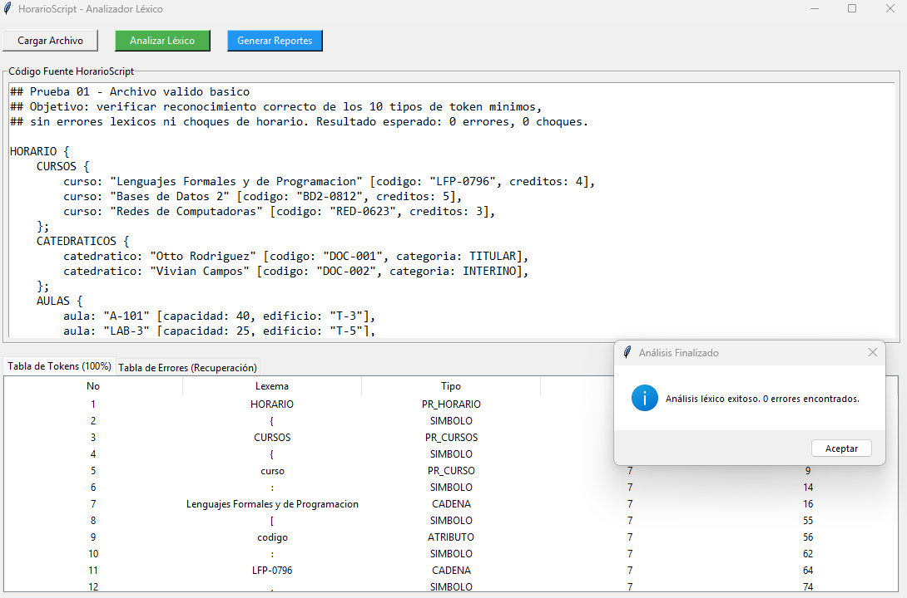
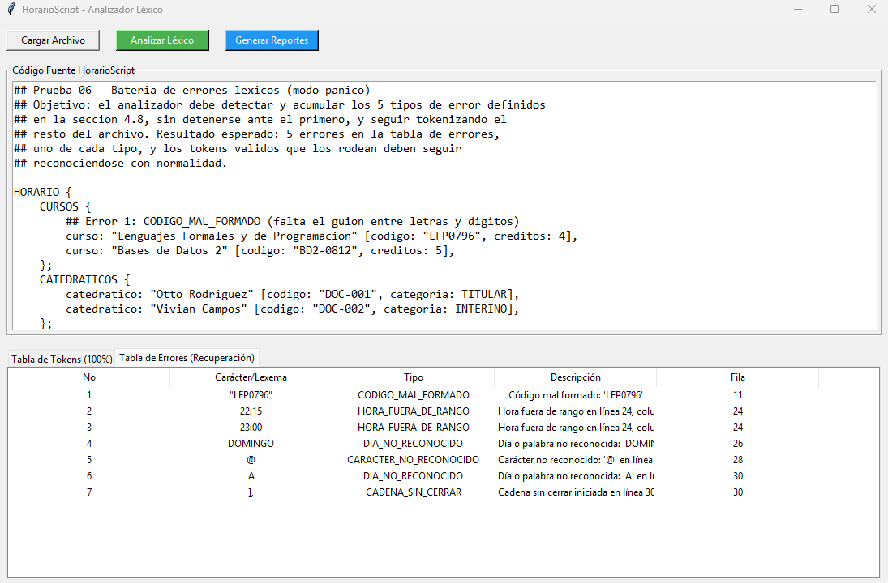
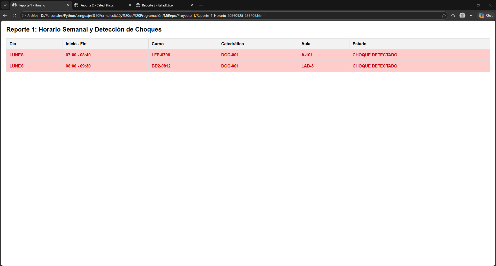
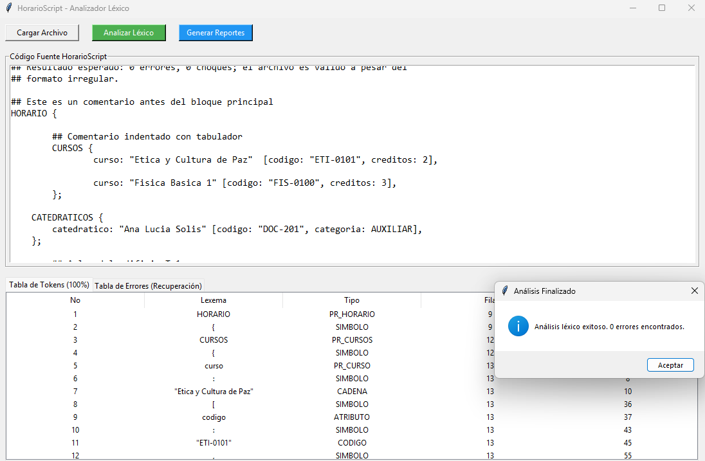

# Documento de Casos de Prueba: HorarioScript

**UNIVERSIDAD DE SAN CARLOS DE GUATEMALA**  
**Facultad de Ingeniería**  
**Proyecto 1 - Lenguajes Formales y de Programación**  
**Edgar Alfredo Donis Llamas - 202307788**
---

## Caso 1: Archivo Válido Completo
* **Descripción:** Se ingresa un archivo `.hor` que contiene las 4 secciones (HORARIO, CURSOS, CATEDRATICOS, AULAS, CLASES) con sintaxis perfecta.
* **Entrada:** Archivo `prueba_valida.hor`.
* **Resultado Esperado:** Tabla de tokens llena correctamente. 0 errores léxicos.
* **Resultado Obtenido:** El analizador reconoció todos los tokens sin registrar ningún error.
* **Evidencia:**  

## Caso 2: Error Léxico (Carácter No Reconocido)
* **Descripción:** Se evalúa la respuesta del AFD ante un carácter que no pertenece al alfabeto del lenguaje (ejemplo: `@` o `%`).
* **Entrada:** `curso: "Bases de Datos" @`
* **Resultado Esperado:** Tokenización continua (modo pánico) y registro del error "Carácter no reconocido: '@'" indicando línea y columna[cite: 1].
* **Resultado Obtenido:** El error fue capturado en la tabla de Errores y el análisis no se detuvo.
* **Evidencia:**  

## Caso 3: Hora Fuera de Rango
* **Descripción:** Se ingresa una hora que excede el rango institucional permitido (06:00 a 21:00)[cite: 1].
* **Entrada:** `inicio: 22:30`
* **Resultado Esperado:** Generación de un error léxico del tipo "HORA_FUERA_DE_RANGO" en la posición exacta[cite: 1].
* **Resultado Obtenido:** Se detectó la hora inválida y se agregó a la tabla de errores.
* **Evidencia:**  
 

## Caso 4: Día No Reconocido
* **Descripción:** Se escribe un día inválido o mal escrito que no pertenece a la enumeración de LUNES a SABADO[cite: 1].
* **Entrada:** `[dia: DOMINGO, inicio: ...]`
* **Resultado Esperado:** Error léxico tipo "DIA_NO_RECONOCIDO" indicando el valor inválido[cite: 1].
* **Resultado Obtenido:** El AFD clasificó la palabra como no reconocida exitosamente.
* **Evidencia:**  

## Caso 5: Código Mal Formado
* **Descripción:** Se ingresa un código que no respeta el patrón estricto de "Letras + guión + dígitos"[cite: 1].
* **Entrada:** `codigo: "LFP0796"` (sin guión) o `codigo: "123-LFP"` (números primero).
* **Resultado Esperado:** Error léxico tipo "CODIGO_MAL_FORMADO"[cite: 1].
* **Resultado Obtenido:** Se validó correctamente la restricción de formato del autómata.
* **Evidencia:**  

## Caso 6: Cadena Sin Cerrar
* **Descripción:** Se abre una cadena de texto con comillas dobles pero ocurre un salto de línea o fin de archivo sin cerrarla[cite: 1].
* **Entrada:** `curso: "Lenguajes Formales \n`
* **Resultado Esperado:** Error léxico "CADENA_SIN_CERRAR" indicando la posición donde inició la comilla[cite: 1].
* **Resultado Obtenido:** El sistema detectó la falta de cierre de la cadena.
* **Evidencia:**  

## Caso 7: Choques de Horario Simulados
* **Descripción:** Se programan dos clases para el mismo catedrático o la misma aula exactamente en el mismo día y hora inicial[cite: 1].
* **Entrada:** `DOC-001` asignado el `LUNES` a las `07:00` en dos clases distintas.
* **Resultado Esperado:** El Reporte 1 HTML debe resaltar ambas filas en color rojo indicando el conflicto[cite: 1].
* **Resultado Obtenido:** Choque detectado visualmente en el reporte de horario semanal.
* **Evidencia:**  

## Caso 8: Casos Borde (Espacios y Comentarios)
* **Descripción:** Se procesa un archivo con múltiples espacios en blanco, tabulaciones excesivas y comentarios de línea largos[cite: 1].
* **Entrada:** `## Comentario largo con símbolos !@# \n    HORARIO    {  `
* **Resultado Esperado:** Los contadores de línea y columna deben mantenerse precisos sin generar errores léxicos[cite: 1].
* **Resultado Obtenido:** Ignoró silenciosamente los espacios y comentarios actualizando la posición correctamente.
* **Evidencia:**  
